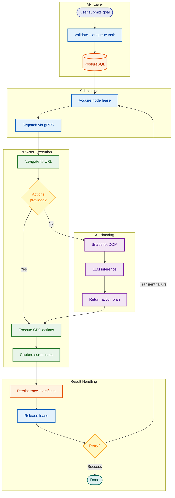
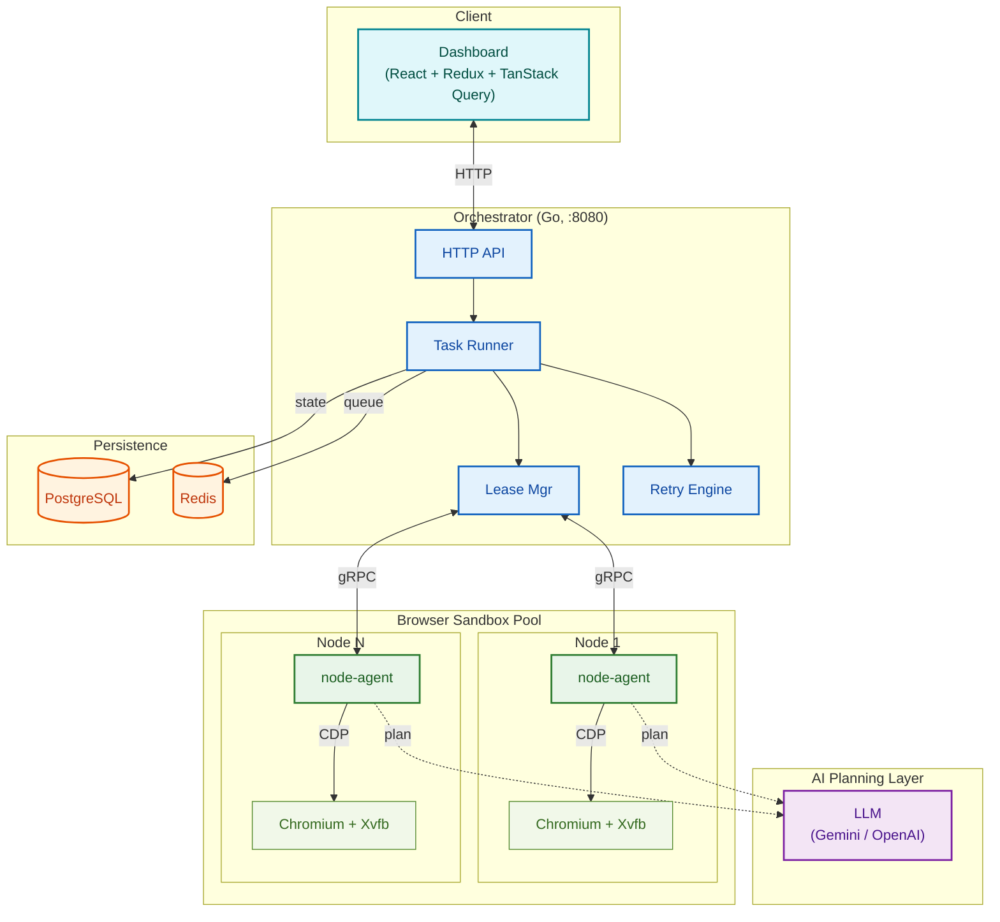

# Browser-use

An AI agent-driven browser orchestration engine. A distributed system that autonomously operates sandboxed Chromium workers to execute multi-step browser workflows from natural-language goals, without predefined scripts.

---

## Table of Contents

- [Overview](#overview)
- [Architecture](#architecture)
- [Technology Stack](#technology-stack)
- [Getting Started](#getting-started)
- [API Reference](#api-reference)
- [Dashboard](#dashboard)
- [AI Agent Planner](#ai-agent-planner)
- [Multi-Step Agentic Planning Plan](#multi-step-agentic-planning-plan)
- [Configuration Reference](#configuration-reference)
- [Security and Sandboxing](#security-and-sandboxing)
- [Challenges and Anti-Bot Detection](#challenges-and-anti-bot-detection)
- [Roadmap](#roadmap)
- [Development Commands](#development-commands)
- [Project Structure](#project-structure)
- [Notes](#notes)

---

## Overview

Browser-use is a local-first orchestration engine that converts high-level goals (e.g., "search for browser use on DuckDuckGo and take a screenshot") into concrete browser actions and executes them inside isolated Chromium containers.

The system consists of three main components:

1. **Orchestrator** -- a Go HTTP/gRPC server that manages sessions, queues tasks, leases browser nodes, and tracks execution state in PostgreSQL.
2. **Node-Agent** -- a sidecar binary running inside each browser container. It receives gRPC commands from the orchestrator, drives Chromium via the Chrome DevTools Protocol (CDP), captures screenshots, and reports execution traces.
3. **AI Planner** -- an LLM-backed planning layer (Gemini, OpenAI, or any compatible endpoint) that interprets natural-language goals, inspects live DOM state, and compiles typed action sequences at inference time.

Tasks flow through the system as follows:



---

## Architecture



### Key Design Decisions

- **gRPC over HTTP for node control**: The orchestrator communicates with browser nodes over gRPC for type-safe, low-latency command dispatch. HTTP is used only for the external-facing API.
- **CDP over WebDriver**: The node-agent drives Chromium directly via CDP rather than Selenium/WebDriver. This provides lower-level control over navigation, DOM inspection, and screenshot capture.
- **Fencing tokens for lease safety**: Each node lease carries a fencing token. If a lease expires mid-execution (due to a slow task), the orchestrator will not accept stale results.
- **Write-ahead tracing**: Every action step is persisted to PostgreSQL as it executes, not after. If a node crashes mid-task, the partial trace survives.
- **Deterministic fallback**: When the LLM planner fails or returns malformed output, the system falls back to a deterministic heuristic planner. This ensures zero-downtime operation regardless of model reliability.

---

## Technology Stack

| Layer | Technology |
|---|---|
| Language | Go 1.22+ |
| Node-to-Orchestrator RPC | gRPC + Protobuf |
| Browser Control | Chrome DevTools Protocol (CDP) |
| AI Planning | Gemini 2.5 Flash (or any OpenAI-compatible API) |
| Task State | PostgreSQL |
| Queue and Locks | Redis |
| Container Runtime | Docker Compose |
| Dashboard Frontend | React, Redux Toolkit, TypeScript, TanStack Query |
| Browser Runtime | google-chrome-stable (amd64), chromium (arm64) |
| Virtual Display | Xvfb |

---

## Getting Started

### Prerequisites

- Docker and Docker Compose
- Go 1.22+ (for development and testing)
- Node.js 18+ (for dashboard frontend development)

### Quick Start

1. Boot the stack (builds containers, starts all services, waits for health):
```bash
make up
```

2. Verify the orchestrator is healthy:
```bash
curl http://localhost:8080/healthz
```

3. Verify a browser node has registered:
```bash
curl http://localhost:8080/v1/nodes
```

4. Run a task with a natural-language goal (auto-plans actions via AI planner):
```bash
curl -sS -X POST http://localhost:8080/task \
  -H 'Content-Type: application/json' \
  -d '{"tenant_id":"dashboard","url":"https://example.com","goal":"open page and capture screenshot"}'
```

5. Run a task with explicit actions (no AI planner involved):
```bash
curl -sS -X POST http://localhost:8080/task \
  -H 'Content-Type: application/json' \
  -d '{
    "url":"https://duckduckgo.com",
    "goal":"search for browser use",
    "actions":[
      {"type":"wait_for","selector":"input[name=\"q\"]","timeout_ms":8000},
      {"type":"type","selector":"input[name=\"q\"]","text":"browser use"},
      {"type":"click","selector":"button[type=\"submit\"]"},
      {"type":"wait","delay_ms":1200}
    ]
  }'
```

6. Open the dashboard:
```bash
open http://localhost:8080/dashboard
```

### Alternative: Local Warm Pool Mode

Run the orchestrator on the host with dynamically provisioned browser containers:
```bash
make dev-pool
```

---

## API Reference

### Sessions

| Method | Endpoint | Description |
|---|---|---|
| `POST` | `/v1/sessions` | Create a session |
| `DELETE` | `/v1/sessions/{id}` | Delete a session |

### Tasks

| Method | Endpoint | Description |
|---|---|---|
| `POST` | `/v1/tasks` | Queue a task (returns `202 Accepted`; auto-creates `session_id` when omitted) |
| `POST` | `/task` | Queue and wait for completion (returns `200 OK`) |
| `GET` | `/v1/tasks/{id}` | Get task status, result, and trace |
| `GET` | `/v1/tasks?limit=N` | List recent tasks |
| `GET` | `/v1/tasks/stats?limit=N` | Aggregated task metrics |
| `POST` | `/v1/tasks/{id}/replay` | Clone and re-queue a task |
| `POST` | `/v1/tasks/{id}/cancel` | Cancel a queued or running task |
| `GET` | `/v1/tasks/{id}/replay_chain` | Replay lineage |
| `GET` | `/v1/tasks/{id}/replays` | Direct replay children |

### Nodes

| Method | Endpoint | Description |
|---|---|---|
| `GET` | `/v1/nodes` | List registered browser nodes |
| `POST` | `/v1/nodes/register` | Node self-registration (internal) |
| `POST` | `/v1/nodes/{id}/heartbeat` | Node heartbeat (internal) |

### Other

| Method | Endpoint | Description |
|---|---|---|
| `GET` | `/healthz` | Orchestrator health check |
| `GET` | `/metrics` | Prometheus-style metrics |
| `GET` | `/dashboard` | Operator dashboard |
| `GET` | `/artifacts/screenshots/{file}` | Stored screenshot artifacts |

### Idempotency

Send an `Idempotency-Key` header on `POST /v1/sessions`, `POST /v1/tasks`, and `POST /v1/tasks/{id}/replay` to get safe retries without duplicate resources.

---

## Dashboard

The operator dashboard provides real-time visibility into the system:

- Node fleet status with heartbeat and version metadata
- Task feed with filtering by status, search, blockers, failures, and artifacts
- Task detail panel with metadata, execution trace, lineage, and replay controls
- Task submission form with automatic session creation per task
- Execution trace panel with:
  - Step-level progress bar (succeeded/failed segments)
  - Action-type icons and rich summaries
  - Inline parameter badges (pixels, delay, timeout, selector)
  - Collapsible step detail with timestamps, output, errors, and screenshots
- Screenshot preview modal
- Failure triage list
- Prometheus-style metrics endpoint

### Running the Dashboard in Development

```bash
make ui-dev    # Vite dev server with hot reload
make ui-build  # Production build
```

---

## AI Agent Planner

When a task is submitted without explicit `actions`, the node-agent invokes an AI planner to generate an action plan from the goal.

### Planner Modes

| Mode | Description |
|---|---|
| `template` | Deterministic heuristic planner (default, no external calls) |
| `openai` | Direct LLM planning via OpenAI Chat Completions API |
| `endpoint` | External planner API (bring your own service) |

### Configuring Gemini as the AI Planner

Set these environment variables in `deploy/compose/.env`:

```env
NODE_AGENT_PLANNER_MODE=openai
NODE_AGENT_PLANNER_AUTH_TOKEN=<your-google-api-key>
NODE_AGENT_PLANNER_MODEL=gemini-2.5-flash
NODE_AGENT_PLANNER_ENDPOINT_URL=https://generativelanguage.googleapis.com/v1beta/openai/chat/completions
```

### How It Works

1. The node-agent snapshots the current DOM, extracting visible interactive elements (role, name, text, selector, coordinates).
2. The snapshot and natural-language goal are sent to the LLM as a structured prompt.
3. The LLM returns a typed JSON action plan:
   ```json
   {
     "actions": [
       {"type": "scroll", "text": "down", "pixels": 3000},
       {"type": "wait", "delay_ms": 500}
     ]
   }
   ```
4. The node-agent validates and executes each action via CDP.

### Fault Tolerance

- **FlexInt deserialization**: LLMs frequently return numeric values as strings (e.g., `"5000"` instead of `5000`). A custom `FlexInt` JSON codec transparently handles both forms.
- **Heuristic fallback**: If the LLM returns invalid JSON, times out, or fails entirely, the system falls back to a deterministic template planner.
- **Structured prompting**: The system prompt explicitly documents each action type with field names, types, and constraints to minimize malformed output.

### Supported Action Types

| Action | Fields | Description |
|---|---|---|
| `wait_for` | `selector`, `timeout_ms` | Wait for an element to appear |
| `click` | `selector` | Click an element |
| `type` | `selector`, `text` | Type text into an input |
| `scroll` | `text` ("up"/"down"), `pixels` | Scroll the page |
| `wait` | `delay_ms` | Pause execution |
| `extract_text` | `selector` | Extract text content from an element |
| `press_enter` | `selector` | Press Enter on an element |
| `wait_for_url_contains` | `text`, `timeout_ms` | Wait for URL to contain a substring |

---

## Multi-Step Agentic Planning Plan

Goal: move from one-shot planning to a closed loop where the planner observes action results and re-plans until the task reaches success, failure, or a step budget limit.

### Phase 0: Contracts and Limits (planned)
1. Define a `plan_step` contract:
   - Input: `{goal, current_url, page_snapshot, prior_steps, last_action_result}`
   - Output: `{next_action, stop, stop_reason}`
2. Add max limits:
   - `max_planner_steps` (for example: 12)
   - `max_planner_failures` (for example: 2)
3. Persist per-step planner metadata into task trace.

### Phase 1: Observe -> Act -> Re-plan Loop (planned)
1. Execute exactly one action per planner round.
2. After each action, capture a fresh compact page snapshot.
3. Feed the latest result into planner for the next decision.
4. Stop early when planner returns `stop=true`.

### Phase 2: Structured Action Result Feedback (planned)
1. Standardize result payloads for actions:
   - `click`: clicked selector + focus/url delta
   - `type`: typed text + value verification
   - `extract_text`: extracted output + validation status
2. Add blocker-aware feedback (`captcha`, `human_verification_required`) so planner can terminate instead of looping.

### Phase 3: Reliability and Guardrails (planned)
1. Re-plan only on safe conditions; avoid infinite oscillation.
2. Add loop-detection heuristics:
   - repeated same action/selector
   - repeated identical URL/title snapshots
3. Add deterministic fallback path when planner is unavailable.

### Phase 4: Evaluation Harness (planned)
1. Add fixture scenarios for multi-step tasks:
   - search -> click result -> extract price/title
2. Track metrics:
   - `planner_rounds_per_task`
   - `task_success_rate`
   - `planner_replan_fail_rate`
3. Add regression CI tests before enabling by default.

---

## Configuration Reference

### Orchestrator

| Variable | Description | Default |
|---|---|---|
| `ORCHESTRATOR_POOL_ENABLED` | Enable warm-pool node management | `false` |
| `ORCHESTRATOR_POOL_TARGET_READY` | Target count of ready browser nodes | `1` |
| `ORCHESTRATOR_NODE_LEASE_TTL` | Lease duration before expiry | `60s` |
| `ORCHESTRATOR_TASK_MAX_RETRIES` | Default retry count for failed tasks | `2` |
| `ORCHESTRATOR_TASK_RETRY_BASE_DELAY` | Initial retry delay | `2s` |
| `ORCHESTRATOR_TASK_RETRY_MAX_DELAY` | Maximum retry delay | `30s` |
| `ORCHESTRATOR_TASK_DOMAIN_BLOCK_COOLDOWN` | Per-domain cooldown after bot blocks | `5m` |
| `ORCHESTRATOR_API_KEY` | API key for write endpoints | (none) |
| `ORCHESTRATOR_RATE_LIMIT_PER_MINUTE` | Per-client rate limit on write endpoints | (none) |
| `ORCHESTRATOR_DASHBOARD_DIST` | Override path for dashboard frontend bundle | (auto) |
| `ORCHESTRATOR_IDEMPOTENCY_TTL` | Idempotency key retention | `24h` |
| `ORCHESTRATOR_IDEMPOTENCY_LOCK_TTL` | Idempotency lock duration | `30s` |

### Node-Agent / Planner

| Variable | Description | Default |
|---|---|---|
| `NODE_AGENT_PLANNER_MODE` | Planner mode: `template`, `openai`, `endpoint` | `template` |
| `NODE_AGENT_PLANNER_AUTH_TOKEN` | API key for LLM provider | (none) |
| `NODE_AGENT_PLANNER_MODEL` | Model name | `gpt-4o-mini` |
| `NODE_AGENT_PLANNER_ENDPOINT_URL` | LLM endpoint URL | OpenAI default |
| `NODE_AGENT_PLANNER_TIMEOUT` | Planner request timeout | `30s` |
| `NODE_AGENT_PLANNER_MAX_ELEMENTS` | Max DOM elements sent to planner | `50` |
| `NODE_AGENT_TRACE_SCREENSHOTS` | Enable per-step trace screenshots | `false` |

---

## Security and Sandboxing

Each browser node runs inside a hardened Docker container:

- **Non-root process**: The node-agent and Chrome run as an unprivileged user.
- **Read-only root filesystem**: Container filesystem is read-only. Writable paths (Chrome profile, tmp, screenshots) are mounted as tmpfs.
- **Dropped capabilities**: All Linux capabilities are dropped. `no-new-privileges` is enforced.
- **Resource limits**: CPU, memory, and PID limits are set per container to prevent runaway processes.
- **No exposed debug ports**: Chrome's remote debugging port is never published to the host network.
- **Egress policy enforcement**: Container-level network policies restrict outbound traffic.

---

## Challenges and Anti-Bot Detection

### The Problem

Many websites deploy anti-bot systems (Cloudflare, Akamai, PerimeterX, DataDome) that detect and block automated browser access. When this happens, Browser-use records the task as `blocked (bot_blocked)` with the reason `target denied automated access`.

These systems detect automation through multiple signals:

| Detection Vector | What They Check |
|---|---|
| WebDriver flag | `navigator.webdriver === true` (set by Chromium when driven via CDP/WebDriver) |
| User-Agent string | Headless Chrome includes `HeadlessChrome` in the UA |
| CDP detection | JavaScript fingerprints detect the DevTools Protocol connection |
| Canvas/WebGL fingerprint | Automated browsers produce distinct rendering fingerprints |
| TLS fingerprint (JA3/JA4) | The TLS handshake signature differs between headless and regular Chrome |
| Behavioral analysis | Bots exhibit zero mouse movement, instant clicks, no scroll inertia |
| IP reputation | Datacenter IP ranges are flagged; residential IPs are trusted |

### Current Mitigations

- **Blocker detection**: The node-agent detects captcha pages, human verification challenges, and bot-block interstitials. It classifies them as structured blocker metadata (`blocker_type`, `blocker_message`) rather than retrying blindly.
- **Transient interstitial handling**: For likely transient blocks (e.g., Cloudflare "checking your browser" pages), the agent performs a short re-check before classifying the task as blocked.
- **Per-domain cooldowns**: After a `bot_blocked` or `human_verification_required` event, the runner applies a configurable cooldown on that domain to avoid hammering a site that is actively blocking.
- **Full Chromium runtime**: Browser-use runs `google-chrome-stable` with a virtual display (Xvfb), not headless mode. This produces standard rendering fingerprints.

### Planned Anti-Detection Improvements

These are planned improvements to reduce detection rates on protected sites:

1. **Stealth patches**: Inject JavaScript at page load to override `navigator.webdriver`, spoof `navigator.plugins`, `navigator.languages`, and WebGL vendor strings. Similar to `puppeteer-extra-plugin-stealth`.
2. **Chrome launch flag hardening**: Add `--disable-blink-features=AutomationControlled` and related flags to suppress automation indicators at the browser level.
3. **Persistent browser profiles**: Use persistent user data directories with cookies, local storage, and browsing history to mimic a returning user rather than a fresh session.
4. **TLS fingerprint alignment**: Investigate `curl-impersonate` or custom Chromium builds to match the TLS handshake of standard Chrome releases.
5. **Proxy integration**: Support for residential proxy rotation to avoid IP-reputation-based blocking.
6. **Captcha solving integration**: Optional integration with captcha solving services (2Captcha, hCaptcha solver) or vision-model-based solving for challenge pages.

---

## Roadmap

- [ ] Stealth mode (anti-detection patches, launch flag hardening)
- [ ] Persistent browser profiles
- [ ] Proxy rotation support
- [ ] Captcha solving integration
- [ ] Multi-step agentic planning (planner observes results and re-plans)
- [ ] Parallel task execution across node pool
- [ ] Webhook notifications on task completion
- [ ] S3/GCS artifact storage (replace local filesystem)
- [ ] Kubernetes deployment manifests

---

## Development Commands

```bash
make up                  # Build and start local stack
make down                # Stop stack
make logs                # Stream compose logs
make ps                  # List compose services
make health              # Wait for orchestrator readiness
make test                # Run Go tests
make fmt                 # Format all Go files
make proto               # Generate Go protobuf stubs
make run-orchestrator    # Run orchestrator on host
make infra-up            # Start only Redis + PostgreSQL
make run-orchestrator-pool  # Run orchestrator with warm pool
make dev-pool            # Full local warm-pool development mode
make clean-pool-nodes    # Remove pool-managed containers
make soak-local          # Soak test: enqueue many tasks, print reliability summary
make planner-eval        # Run fixture-driven planner regression checks
make ui-dev              # Run dashboard frontend (Vite dev server)
make ui-build            # Build dashboard frontend for production
```

---

## Project Structure

```
browser-use/
  cmd/
    node-agent/          # Browser node-agent binary (CDP driver, planner, gRPC server)
    orchestrator/        # Orchestrator HTTP/gRPC server
  internal/
    api/                 # HTTP handlers, routes, middleware
    gen/                 # Generated protobuf Go stubs
    idempotency/         # Idempotency key store (memory + Redis)
    lease/               # Distributed lease manager (memory + Redis)
    model/               # Domain types (Task, Session, Node)
    pool/                # Warm-pool manager + local Docker provider
    queue/               # Task queue (Redis-backed)
    runner/              # Task execution loop, retry logic
    store/               # PostgreSQL persistence layer
  proto/                 # Protobuf definitions (node.proto)
  deploy/compose/        # Docker Compose config, .env
  docker/                # Dockerfiles (orchestrator, browser-node)
  web/                   # Dashboard frontend (React + TypeScript)
  scripts/               # Helper scripts (soak test)
```

---

## Notes

- Sessions and task state are persisted in PostgreSQL. Queued tasks are reconciled from the database on runner startup.
- Task responses include `screenshot_artifact_url`; `screenshot_base64` is used only as fallback when artifact storage fails.
- Task status payloads include `attempt`, `max_retries`, `next_retry_at`, `trace`, and `extracted_outputs`.
- Dashboard task submission now auto-creates a session when `session_id` is omitted, using `tenant_id` if provided.
- The `POST /task` convenience endpoint waits for task completion by default. Use `POST /v1/tasks` for async queuing.
- `X-Trace-Id: trc_<task_id>` is returned in task creation responses for log correlation.
- API key authentication is optional. Set `ORCHESTRATOR_API_KEY` and send via `X-API-Key` or `Authorization: Bearer <key>`.
- Rate limiting is optional. Set `ORCHESTRATOR_RATE_LIMIT_PER_MINUTE` for per-client fixed-window limiting on write routes.
- Warm-pool manager is feature-flagged for host-run orchestrator mode where `docker` CLI is available. Compose mode uses a static node service by default.
